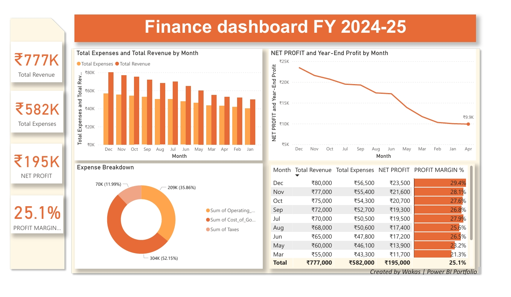

# Financial Dashboard Project

📊 This is a Finance Dashboard created using Power BI.  
It shows:  
- Total Revenue, Expenses, and Net Profit  
- Profit Margin Analysis  
- Expense Breakdown  
- Monthly Trend of Revenue vs Expenses  

## Files
- [PDF version](https://github.com/wakasmnd/Financial-Dashboard/blob/main/Wakas%20Finance%20Project.pdf)
- [POWERBI VERSION](https://github.com/wakasmnd/Financial-Dashboard/blob/1aead7bd86c9ae42257baae2bfebfd8aa2a507f0/Wakas%20Finance%20Project.pbix)
- [Preview](Screenshot_17-8-2025_62419_.jpeg)

## Preview

